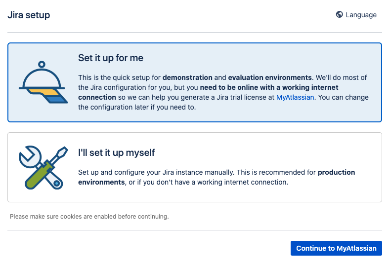
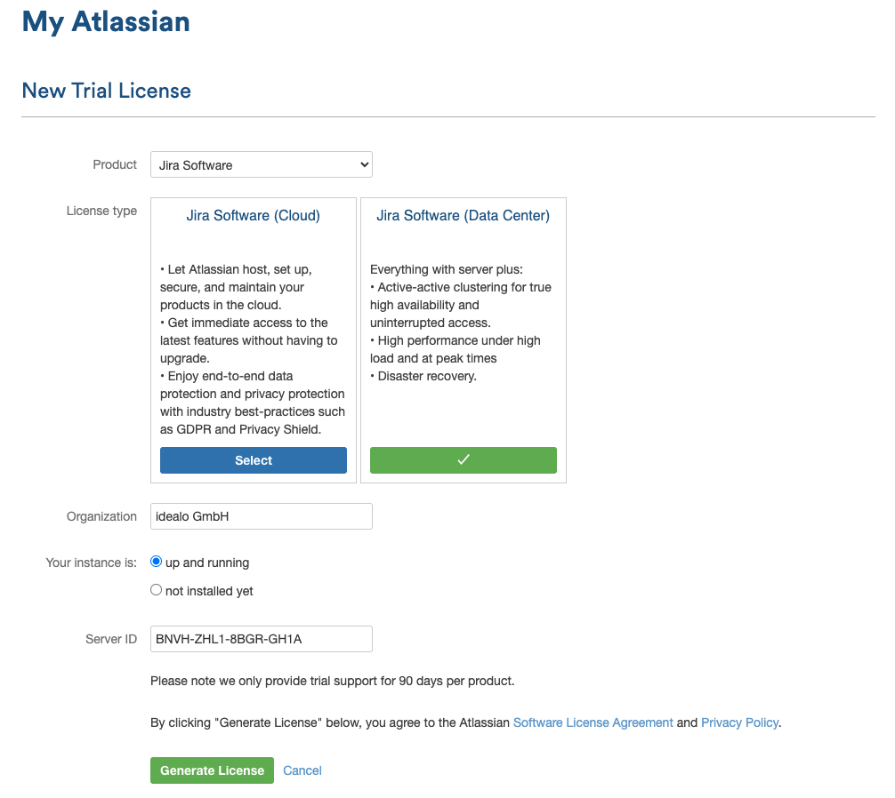
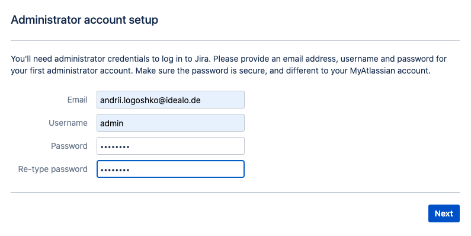

# terraform-provider-jira

Terraform Provider for managing JIRA. (__[View on registry.terraform.io](https://registry.terraform.io/providers/fourplusone/jira/latest)__)

__[Support this project on Patreon](https://www.patreon.com/fourplusone)__

[](https://circleci.com/gh/fourplusone/terraform-provider-jira)

## Data Sources

- Issue Keys from JQL
- Custom Fields

## Resources

- Comments
- Filters & Filter Permissions
- Groups
- Group Memberships
- Issues
- Issue Links
- Issue Types
- Issue Link Types
- Projects
- Project Categories
- Project Roles
- Roles
- Users
- Webhooks

This can be used to interlink infrastructure management with JIRA issues closely.


## Compatibility 


| Version | Status       |  
|---------|--------------|
| Latest  | Tested in CI |
| 7.x     | Untested     |
| Cloud   | Untested     |   

## Install

## Terraform v0.13

Copy this code into yout terraform configuration file (for example `main.tf`)

```hcl
terraform {
  required_providers {
    jira = {
      source = "fourplusone/jira"
      version = "0.1.14"
    }
  }
}
```

Run `terraform init`

## Terraform v0.12 

* Download `terraform-provider-jira` binary from [Github](https://github.com/fourplusone/terraform-provider-jira/releases)
* Unzip the zip file
* Then move `terraform-provider-jira` binary to `$HOME/.terraform.d/plugins` directory

```bash
mkdir -p $HOME/.terraform.d/plugins
mv terraform-provider-jira $HOME/.terraform.d/plugins/terraform-provider-jira

```

* Run `terraform init` in your terraform project

```bash
terraform init
```

Used to initialize the plugin

## Example Usage

Set JIRA URL, Username and Password using environment variables

```bash
export JIRA_URL=http://localhost:8080
export JIRA_USER=username
export JIRA_PASSWORD=password
```

It's also possible to use an API-Token from JIRA cloud. In this case, set 

```bash
export JIRA_URL=https://yourinstance.atlassian.net
export JIRA_USER=username@example.org
export JIRA_PASSWORD=<API-Key>
```

Create terraform config file

```hcl

provider "jira" {
  url = "https://myjira.atlassian.net" # Can also be set using the JIRA_URL environment variable
  # user = "xxxx"                      # Can also be set using the JIRA_USER environment variable
  # password = "xxxx"                  # Can also be set using the JIRA_PASSWORD environment variable
}

// The types will be globally available in JIRA
resource "jira_issue_type" "task" {
  description = "A Task.",
  name = "Task",
  avatar_id = 10318
}

resource "jira_issue_link_type" "blocks" {
  name = "Blocks"
  inward = "is blocked by"
  outward = "blocks"
}

resource "jira_issue" "example" {
  issue_type  = "${jira_issue_type.task.name}"
  project_key = "PROJ"
  summary     = "Created using Terraform"

  // description is optional  
  description = "This is a test issue" 

  // (optional) Instead of deleting the issue, perform this transition 
  delete_transition = 21

  // (optional) Make sure, the issue is in the desired state
  // using state_transition
  state = 10000
  state_transition = 31 
}

resource "jira_comment" "example_comment" {
  body = "Commented using terraform"
  issue_key = "${jira_issue.example.issue_key}"
}

resource "jira_issue" "another_example" {
  issue_type  = "${jira_issue_type.task.name}"
  summary     = "Also Created using Terraform"
  labels      = ["label1", "label2"]
  project_key = "PROJ"
}

data "jira_field" "epic_link" {
  name = "Epic Link"
}

resource "jira_issue" "custom_fields_example" {
  issue_type  = "${jira_issue_type.task.name}"
  summary     = "Also Created using Terraform"
  fields      = {
    (jira_field.epic_link.id) = jira_issue.example_epic.issue_key
  }
  project_key = "PROJ"
}

resource "jira_issue_link" "linked" {
  inward_key = "${jira_issue.example.issue_key}"
  outward_key = "${jira_issue.another_example.issue_key}"
  link_type = "${jira_issue_link_type.blocks.id}"
}

resource "jira_filter" "filter" {
  name = "Simple Filter"
  jql = "project = PROJ"

  // Optional Fields
  description = "All Issues in PROJ"
  favourite = false

  // All Members of project with ID 13102
  permissions {
    type = "project"
    project_id = "13102"
  }

  // All Members of Group "Team A"
  permissions {
    type = "group"
    group_name = "Team A"
  }

  // Any authenticated user
  permissions {
    type = "authenticated"
  }
}

resource "jira_project_category" "category" {
  name = "Managed"
  description = "Managed Projects"
}

resource "jira_project" "project_a" {
  key = "TRF"
  name = "Terraform"
  project_type_key = "business"
  project_template_key = "com.atlassian.jira-core-project-templates:jira-core-project-management"
  lead = "bot"
  // For JIRA Cloud use lead_account_id instead
  lead_account_id = "xxxxxx:xxxxxxxx-xxxx-xxxx-xxxx-xxxxxxxxxxxx"
  permission_scheme = 10400
  notification_scheme = 10300
  category_id = "${jira_project_category.category.id}"
}

// Create a Project with a shared configuration
resource "jira_project" "project_shared" {
	key = "SHARED"
	name = "Project (with shared config)"
	lead = "bot"
	shared_configuration_project_id = "${jira_project.project_a.project_id}"
}


// Create a group named "Terraform Managed"
resource "jira_group" "tf_group" {
  name = "Terraform Managed"
}

// User "bot" will be a Member of "Terraform Managed"

resource "jira_group_membership" "gm_1" {
  username = "bot"
  group = "${jira_group.tf_group.name}"
}

resource "jira_role" "role" {
  name = "Project Manager"
  description = "The Project Managers"
}

// Grant Project Access to user "bot" 
resource "jira_project_membership" "member" {
  project_key = "${jira_project.project_a.key}"
  role_id = "${jira_role.role.id}"
  username = "bot"
}

// Grant Project Access to group "bot" 
resource "jira_project_membership" "group_member" {
  project_key = "${jira_project.project_a.key}"
  role_id = "${jira_role.role.id}"
  group = "${jira_group.tf_group.name}"
}

resource "jira_user" "demo_user" {
  name = "bot"
  email = "bot@example.org"
  display_name = "The Bot"
}

resource "jira_webhook" "demo_hook" {
  name = "Terraform Hook"
  url = "https://demohook"
  jql = "project = PROJ"
  
  // See https://developer.atlassian.com/server/jira/platform/webhooks/ for supported events
  events = ["jira:issue_created"]
}


data "jira_jql" "issues" {
  jql = "project = ${jira_project.project_a.key} ORDER BY key ASC"
}

```

Run `terraform init`

```bash
terraform init
```

```bash

Initializing provider plugins...

Terraform has been successfully initialized!

You may now begin working with Terraform. Try running "terraform plan" to see
any changes that are required for your infrastructure. All Terraform commands
should now work.

If you ever set or change modules or backend configuration for Terraform,
rerun this command to reinitialize your working directory. If you forget, other
commands will detect it and remind you to do so if necessary.
```

Run `terraform plan`

```bash
terraform plan
```

Check if the terraform plan looks good

Run `terraform apply`

```bash
terraform apply
```

## Building 

If you wish to work on the provider, you'll first need [Go](http://www.golang.org) installed on your machine.

*Note:* This project uses [Go Modules](https://blog.golang.org/using-go-modules) making it safe to work with it outside of your existing [GOPATH](http://golang.org/doc/code.html#GOPATH). The instructions that follow assume a directory in your home directory outside of the standard GOPATH (i.e `$HOME/development/terraform-providers/`).

Clone repository to: `$HOME/development/terraform-providers/`

```sh
$ mkdir -p $HOME/development/terraform-providers/; cd $HOME/development/terraform-providers/
$ git clone git@github.com:fourplusone/terraform-provider-jira
...
```

Enter the provider directory and run `make build` to build the provider

```sh
$ make build
```

## Testing

In order to run tests you need to run them against Jira Server.
First follow the steps in [Run Jira Locally](#run-jira-locally) to have a working local instance.

After that open new terminal, cd into project-root and run:
```sh
project-root$ make test JIRA_URL=http://localhost:8080 JIRA_USER=<USERNAME> JIRA_PASSWORD=<PASSWORD>
```

## Install
Makefile contains helper functions used to build, package and install the provider locally on your system.
It's currently written for MacOS, but you can change the variables at the top of the file to match your `OS_ARCH`.
You can find a full list of supported GO_ARCH [here](https://go.dev/doc/install/source#environment).

### Mac
Just run:
```sh
project-root$ make install
```
Jump to [Local Run](#local-run)

### Linux
Build the provider binary:
```sh
project-root$ go build -o terraform-provider-jira
```

Retrieve your system's OS and ARCH:
```sh
project-root$ export OS_ARCH="$(go env GOHOSTOS)_$(go env GOHOSTARCH)"
```

Create the appropriate subdirectory within the user plugins directory for the jira provider if it doesn't exist already:
```sh
project-root$ mkdir -p ~/.terraform.d/plugins/idealo.de/pt/jira/0.1/$OS_ARCH
```

Move the binary to the appropriate subdirectory within your user plugins directory:
```sh
project-root$ mv terraform-provider-jira ~/.terraform.d/plugins/idealo.de/pt/jira/0.1/$OS_ARCH
```

### Local Run

First follow the steps in [Run Jira Locally](#run-jira-locally) to have a local instance.

Cd into `examles/local-run/`

Init Terraform:
```sh
examples/local-run$ terraform init
```

Apply the plan:
```sh
examples/local-run$ JIRA_USER=<USERNAME> JIRA_PASSWORD=<PASSWORD> terraform apply
```

Verify that resources have been created and are in a desired state.

Destroy the plan:
```sh
examples/local-run$ JIRA_USER=<USERNAME> JIRA_PASSWORD=<PASSWORD> terraform destroy
```

## Run Jira Locally

Run local docker instance:
```sh
$ docker run --publish 8080:8080 --name jira --rm -i -t frogbis/jira-software bash
```
Open your browser at: `localhost:8080`



choose **Set it up for me** and hit **Continue to MyAtlassian**



Choose settings as indicated above (**Server ID** is auto-generated) and hit **Generate License**.
Confirm with a popped up window that you want to install license for localhost.



Set up a new user that you'll be using to run your tests with and hit **Next**.

Hit **Let's get started** in the next window.

Login and create new project of any type.

You are all set!!!
